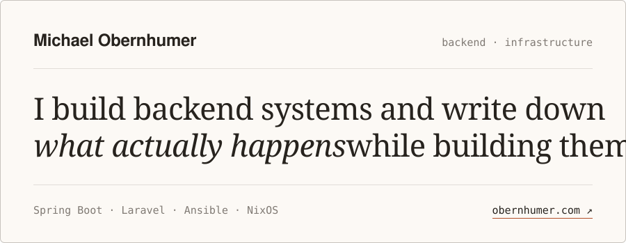

<!-- markdownlint-disable MD033 MD041 -->

<picture>
  <source media="(prefers-color-scheme: dark)" srcset="assets/header-dark.svg">
  
</picture>

I'm a backend developer at Hargassner and a computer science student at TU Wien. At work that's an end-of-line testing system in Spring Boot, and a Laravel platform where clients and translation offices upload language files, have them machine-translated by an LLM, and take them through versioning and review.

Outside of work it's Linux and running my own services: NixOS on the laptop, Debian on the homelab, and a service stack rebuilt so that everything about the server lives in one Git repository. I write it down at [obernhumer.com](https://obernhumer.com), mostly because that's the only way I remember what I learned.

## 01 · Writing

<!-- BLOG-POST-LIST:START -->
<samp>2026-09-23</samp>&ensp;**[What moving my homelab to Ansible actually took](https://obernhumer.com/w/001/)** 
Almost three years of Docker Compose set up by hand over SSH, moved into an Ansible repository in a week, and the bugs that showed idempotent and reproducible aren’t the same claim.

<samp>2026-09-23</samp>&ensp;**[Email aliases for a year: small cost, no payoff yet](https://obernhumer.com/w/002/)** 
Every account I have now uses its own SimpleLogin alias. A year in, the daily cost turned out small, the fear of silent mail loss didn’t go away, and none of the 37 aliases has needed disabling.

<!-- BLOG-POST-LIST:END -->

[all writing →](https://obernhumer.com/writing) · [rss ↗](https://obernhumer.com/rss.xml)

## 02 · Projects

**[Self-hosted homelab on Ansible](https://obernhumer.com/projects/self-hosted-homelab-on-ansible/)** 
Caddy, Uptime Kuma, Nextcloud, Immich, SimpleLogin and ntfy, with restic backups to a Raspberry Pi, rebuilt on Ansible instead of configured by hand. Every change runs on a throwaway VM before it reaches production. The repository stays private because it holds the vault, so the [write-up](https://obernhumer.com/w/001/) is where the details are. 
<samp>active since 2023-10 · Ansible · Docker Compose · Debian · Caddy · restic</samp>

**[nixos-config](https://github.com/ObernhumerMichael/nixos-config)** 
My laptop, declared as a flake: NixOS and Home Manager, split into system, CLI, dev and desktop modules, themed through Stylix. 
<samp>Nix · Home Manager · GNOME · Stylix</samp>

**[blog](https://github.com/ObernhumerMichael/blog)** 
The source of obernhumer.com. A static Astro site built to its own written design system, and CI that holds it to that: token-only CSS, accessibility and visual-baseline tests in Playwright, link checks, and one ADR per architectural decision. 
<samp>Astro · TypeScript · Playwright · Nix</samp>

## 03 · Experience

<samp>Oct 2025 — now&nbsp;&nbsp;&nbsp;&nbsp;&nbsp;&nbsp;&nbsp;</samp>Computer Science, TU Wien 
<samp>May 2025 — now&nbsp;&nbsp;&nbsp;&nbsp;&nbsp;&nbsp;&nbsp;</samp>Backend developer, Hargassner 
<samp>Jul 2024 — Mar 2025&nbsp;&nbsp;</samp>Civil service (Zivildienst) 
<samp>Summers 2022, 2023&nbsp;&nbsp;&nbsp;</samp>Network technician intern, Ocilion IPTV Technologies 
<samp>2019 — 2024&nbsp;&nbsp;&nbsp;&nbsp;&nbsp;&nbsp;&nbsp;&nbsp;&nbsp;&nbsp;</samp>HTL Braunau, Cyber Security

## 04 · Elsewhere

[mail@obernhumer.com](mailto:mail@obernhumer.com) · [obernhumer.com](https://obernhumer.com) · [PGP key](https://obernhumer.com/pgp.asc)
